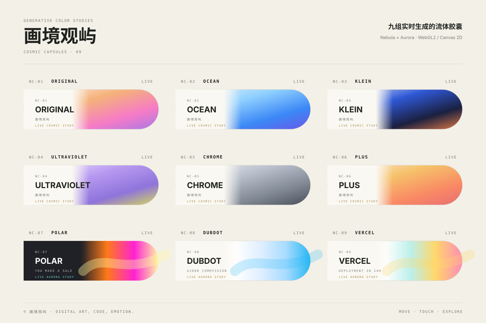

# Huajing Guanyu · Cosmic Capsules

[中文说明](README.md)

Nine realtime generative capsules: **Original, Ocean, Klein, Ultraviolet, Chrome, Plus, Polar, Dubdot, and Vercel**.

- `NC-01 ~ NC-06`: cosmic nebula fluid mode
- `NC-07 POLAR`: dark capsule with orange, magenta, and warm-white light ribbons; no dark outer outline
- `NC-08 DUBDOT`: white capsule with pale blue, sky blue, and cyan light ribbons
- `NC-09 VERCEL`: white capsule with mint, soft yellow, and pale pink light ribbons

The three new styles are appended in the exact reference-image order and use dedicated `aurora` motion profiles. All three are rendered inside the WebGL2 fluid pipeline, with Canvas 2D fallback when WebGL2 is unavailable. The page continues to support autoplay, pointer/touch gravity, pause controls, randomization, cool/warm filtering, and an immersive viewer.



## One-click launchers (recommended)

Node.js 18 or newer is required.

```text
一键启动/
├── macOS-一键启动.command
├── Windows-一键启动.bat
└── 一键启动说明.txt
```

You can also run this command in the project root:

```bash
npm start
```

Default address:

```text
http://127.0.0.1:4173
```

If the port is occupied, the server automatically tries later ports. The project uses ES Modules, so run it through the local server instead of opening `index.html` directly.

## Controls

- **Autoplay**: all nine capsules start moving after the page loads.
- **Shuffle**: regenerates shape parameters for every capsule.
- **Pause / Continue**: freezes or resumes all visible animations.
- **All / Cool / Warm**: filters capsules by palette group.
- **Click a capsule**: opens the corresponding full-screen viewer.
- **Move or touch**: temporarily changes the gravity direction of the nebula or light ribbons.

## Rendering modes

### Nebula

The original six presets use layered noise, stars, clouds, and swirls to form cosmic-fluid materials.

### Aurora

The three new presets use low-frequency noise and multiple light ribbons to create smoothly moving gradients:

```text
NC-07 POLAR
NC-08 DUBDOT
NC-09 VERCEL
```

`POLAR` uses a dark text area without an outer outline. `DUBDOT` and `VERCEL` keep white capsule bases. All three use the same WebGL / Canvas internal ribbon-rendering standard, with no separate CSS sweep or cloud animation layers.

## Development and verification

```bash
npm run check
npm test
```

## Main files

```text
index.html              Page structure
styles.css              Existing page and component styles
aurora.css              Aurora capsule theme overrides
src/presets.js          Nine presets, ordering, colors, and parameters
src/cosmic-shader.js    Nebula and Aurora WebGL2 rendering
src/fallback.js         Canvas 2D fallback rendering
src/main.js             Page interaction and render scheduling
scripts/serve.mjs       Local static server
```

## Network scope

By default, the project serves only on local address `127.0.0.1`. It is not published to the internet and does not upload user data.
