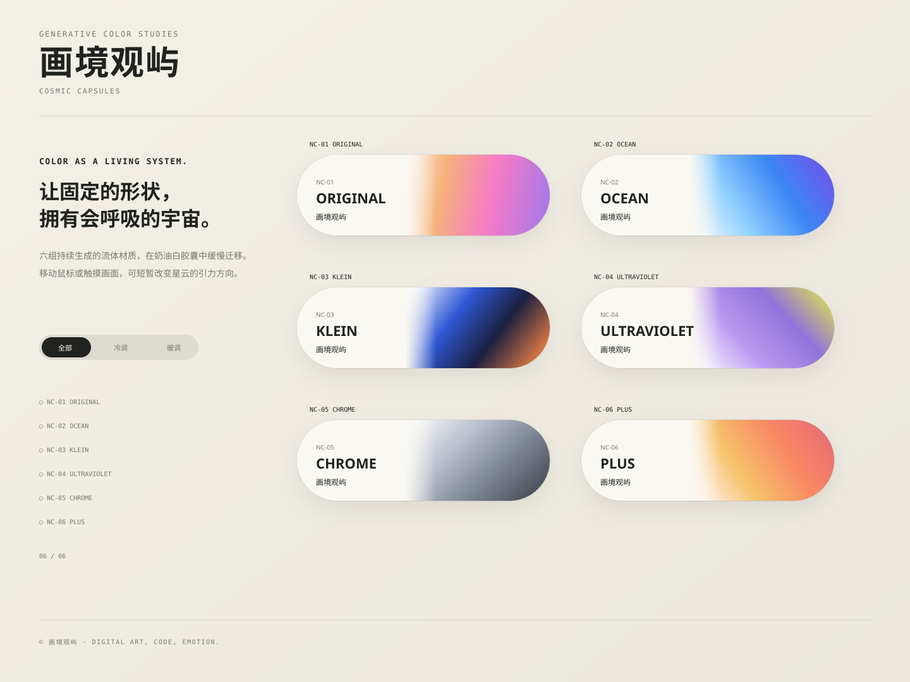

# 画境观屿 · 宇宙胶囊

[English README](README.en.md)

九组实时生成的流体胶囊：**Original、Ocean、Klein、Ultraviolet、Chrome、Plus、Polar、Dubdot、Vercel**。

- `NC-01 ~ NC-06`：宇宙星云流体模式
- `NC-07 POLAR`：黑底青绿、蓝紫柔光带
- `NC-08 DUBDOT`：白底奶油橙、珊瑚粉柔光带
- `NC-09 VERCEL`：白底薄荷青、天蓝与淡紫柔光带

新增三组严格按照参考图片的实际顺序追加，并使用独立的 `aurora` 柔光动效模式。页面继续支持 WebGL2、Canvas 2D 降级、自动播放、鼠标与触摸引力、暂停、随机形态、冷暖筛选和沉浸式预览。



## 一键启动（推荐）

项目要求 Node.js 18 或更高版本。

```text
一键启动/
├── macOS-一键启动.command
├── Windows-一键启动.bat
└── 一键启动说明.txt
```

也可以在项目根目录运行：

```bash
npm start
```

默认地址：

```text
http://127.0.0.1:4173
```

若端口被占用，服务会自动尝试后续可用端口。项目使用 ES Modules，请通过本地服务运行，不要直接双击 `index.html`。

## 页面操作

- **自动播放**：九组胶囊加载后立即开始流动。
- **随机切换**：重新生成所有胶囊的形态参数。
- **暂停 / 继续**：冻结或恢复全部可见动效。
- **全部 / 冷调 / 暖调**：按配色分组筛选。
- **点击胶囊**：进入对应样式的全屏沉浸预览。
- **移动鼠标或触摸**：短暂改变星云或柔光带的引力方向。

## 渲染模式

### Nebula

原有六组使用多层噪声、星点、云团与旋涡构成宇宙星云材质。

### Aurora

新增三组使用低频噪声与多条柔光带生成平滑迁移的渐变：

```text
NC-07 POLAR
NC-08 DUBDOT
NC-09 VERCEL
```

`POLAR` 使用独立深色文字区；`DUBDOT` 与 `VERCEL` 保持白色胶囊底。WebGL2 不可用时，会自动切换到 Canvas 2D 柔光降级动画。

## 开发与验证

```bash
npm run check
npm test
```

## 主要文件

```text
index.html              页面结构
styles.css              原有页面与组件样式
aurora.css              新增柔光胶囊主题样式
src/presets.js          九组动效顺序、颜色和参数
src/cosmic-shader.js    Nebula / Aurora WebGL2 渲染
src/fallback.js         Canvas 2D 降级渲染
src/main.js             页面交互和渲染调度
scripts/serve.mjs       本地静态服务
```

## 网络范围

项目默认只监听本机地址 `127.0.0.1`，不会自动发布到互联网，也不会上传用户数据。
