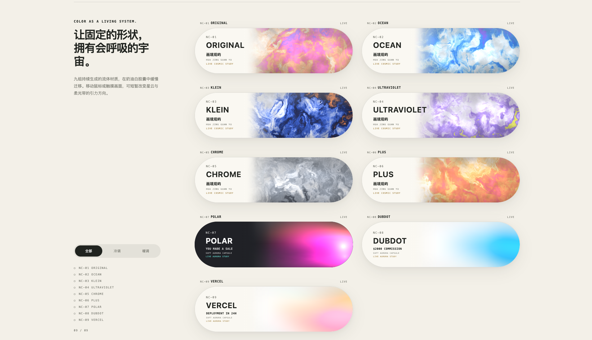

# 画境观屿 · 宇宙胶囊

[English README](README.en.md)

当前版本：**项目 1.6.0 / NC-10～NC-12 视觉版本 v2.4.7**。

项目包含十二组实时动效胶囊，分为三种渲染模式：Nebula、Aurora 与 Progress。

## 胶囊列表

### Nebula · 宇宙星云

- `NC-01 ORIGINAL`
- `NC-02 OCEAN`
- `NC-03 KLEIN`
- `NC-04 ULTRAVIOLET`
- `NC-05 CHROME`
- `NC-06 PLUS`

使用多层噪声、星点、云团和旋涡生成宇宙星云材质。

### Aurora · 柔光流带

- `NC-07 POLAR`：深色胶囊，橙色、洋红与暖白柔光带
- `NC-08 DUBDOT`：白色胶囊，浅蓝、天蓝与青蓝柔光带
- `NC-09 VERCEL`：白色胶囊，薄荷绿、淡黄与浅粉柔光带

三组均使用内部 WebGL2 柔光流带渲染；WebGL2 不可用时自动切换到 Canvas 2D。

### Progress · 流体进度

- `NC-10 MODEL TRAINING`
- `NC-11 AGENT MIGRATION`
- `NC-12 VISUAL TRAINING`

点击筛选栏中的 **“进度”** 后，三条进度胶囊按一行一个、单列居中显示。

当前视觉与交互规范：

- 桌面固定尺寸：`454 × 104px`
- 页面放大时不继续拉伸；小屏空间不足时才自适应缩小
- 胶囊内部主标题统一显示品牌名称 **“画境观屿”**
- 自动进度仅正向、线性、匀速增长，不回退、不随机跳值
- `NC-10`：`1.10%/秒`
- `NC-11`：`1.00%/秒`
- `NC-12`：`1.05%/秒`
- 到达 `100%` 后保持，不自动重置
- 支持鼠标、触摸与键盘手动调整进度
- 手动调整后等待约 `1.8 秒`，再从当前位置继续向右加载
- “随机切换”只改变流体纹理时相，不改变百分比
- 使用 `240 × 80` 平滑边界轨迹与 24 帧运行时纹理图集，降低细碎抖动
- WebGL2 不可用时保留 Canvas 2D 降级

> `NC-01～NC-09` 继续作为冻结模块维护。`src/main.js`、`src/presets.js`、`src/cosmic-shader.js`、`src/fallback.js` 和 `aurora.css` 不因进度模块更新而改动。



## 一键启动

项目要求 Node.js 18 或更高版本。

```text
一键启动/
├── macOS-一键启动.command
├── Windows-一键启动.bat
└── 一键启动说明.txt
```

也可以在项目根目录运行：

```bash
npm start
```

默认地址：

```text
http://127.0.0.1:4173
```

若端口被占用，服务会自动尝试后续可用端口。项目使用 ES Modules，请通过本地服务运行，不要直接双击 `index.html`。

## 页面操作

- **自动播放**：页面加载后立即运行可见动效
- **随机切换**：重新生成原有胶囊形态；进度胶囊仅切换流体纹理时相
- **暂停 / 继续**：冻结或恢复全部可见动效和自动进度
- **全部 / 冷调 / 暖调 / 进度**：按类型与配色筛选
- **点击原有胶囊**：进入对应样式的沉浸预览
- **拖动进度胶囊**：直接修改当前百分比
- **键盘控制进度**：方向键每次调整 2%，Page Up / Page Down 每次调整 10%，Home / End 跳到 0% / 100%

## 渲染结构

### Nebula

`NC-01～NC-06` 由 `src/cosmic-shader.js` 负责 WebGL2 星云渲染，`src/fallback.js` 提供 Canvas 2D 降级。

### Aurora

`NC-07～NC-09` 使用独立 Aurora 参数和 `aurora.css` 主题覆盖，不叠加外部视频或 CSS 扫光层。

### Progress

`NC-10～NC-12` 通过独立增量模块接入，不侵入原九组渲染主链：

- `src/progress-presets.js`：进度编号、配色、初始值与加载速度
- `src/progress-capsules.js`：组件、拖动、键盘与单向进度逻辑
- `src/progress-motion-data.js`：平滑边界轨迹生成
- `src/progress-reference-atlases.js`：运行时参考纹理图集
- `src/progress-flow-renderer.js`：WebGL2 流体与边界渲染
- `src/progress-flow-overlays.js`：WebGL 叠层与 Canvas 降级切换
- `src/progress-entry.js`：等待原九组挂载后接入进度模块
- `progress.css`：进度筛选、固定尺寸与响应式布局

## 开发与验证

```bash
npm run check
npm test
```

`npm test` 会同时验证：

- `NC-01～NC-09` 编号和原模块边界未被进度模块侵入
- `NC-10～NC-12` 速度与正向加载逻辑
- 品牌文案“画境观屿”
- `454 × 104px` 固定窄幅布局
- WebGL2、运行时纹理和 Canvas 2D 降级入口

## 主要文件

```text
index.html                         页面结构与筛选入口
styles.css                         原有页面与组件样式
aurora.css                         NC-07～NC-09 柔光主题
progress.css                       NC-10～NC-12 固定窄幅布局
src/presets.js                     NC-01～NC-09 冻结预设
src/cosmic-shader.js               Nebula / Aurora WebGL2 渲染
src/fallback.js                    原九组 Canvas 2D 降级
src/main.js                        原九组交互与渲染调度
src/progress-*.js                  三组进度胶囊独立模块
progress-tests.mjs                 进度模块与冻结边界验证
scripts/serve.mjs                  本地静态服务
```

## 网络范围

项目默认只监听本机地址 `127.0.0.1`，不会自动发布到互联网，也不会上传用户数据。
