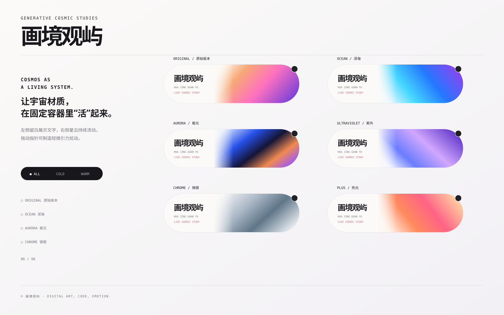

# 画境观屿 · Nebula Capsules（星云胶囊）

一个零运行时依赖的 WebGL 开源视觉项目。页面结构按参考图调整：胶囊左侧保留奶油白文字区域，右侧实时生成宇宙星云、流体颜色与星尘。



## 参考图结构

- 页面左侧保留独立说明栏，右侧使用两列三行胶囊布局。
- 每个胶囊左侧约 46% 为固定留白信息区，品牌文字统一为“画境观屿”。
- 动态星云限制在右侧区域，并在交界处以柔和渐隐过渡。

## 核心能力

- GLSL 实时生成星云，不依赖图片或视频素材
- FBM 多层噪声与 Domain Warping 流体扭曲
- 六套确定性宇宙配色
- 指针与触摸位置形成引力漩涡
- 点击胶囊进入全屏沉浸视图
- 桌面端与移动端响应式排版
- 离屏暂停渲染、页面隐藏暂停、降低动画偏好支持
- WebGL2 不可用时自动切换 Canvas 2D 降级效果
- 已包含 GitHub Pages 自动发布工作流

## 本地运行

```bash
npm start
```

浏览器打开：

```text
http://127.0.0.1:4173
```

## 检查与测试

```bash
npm run check
npm test
```

## 自定义颜色

打开 `src/presets.js`，修改任意预设的 `colors`、`seed` 和 `speed`。

## 开源协议

MIT License，允许个人和商业项目使用、修改与再发布，但需保留版权与许可声明。
